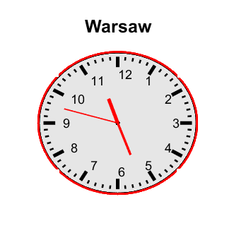

Time for each clock was created as the `global` variable in order to allow for updates through deleting the old hands

Then, using `subplot` function six images are drawn in a figure with a custom function `create_clock`. The latter generates such plot:

  

Until the program receives a stopping command the figure is updated each second in a function `update_time`.
The compilation results in the following animation:

https://github.com/Arseni10Lk/Analog_clock/assets/141524111/ff36e2c0-ee66-4f17-9501-28ae42fd76b1

